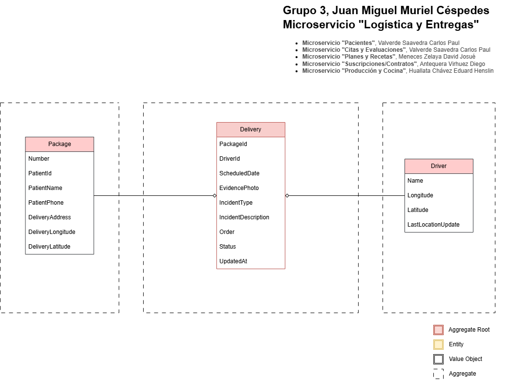

# Microservicio "Logística y Entregas"

Microservicio para gestionar operaciones de reparto (entregas) de paquetes alimenticios. Modela el ciclo de vida de un paquete, la actividad de repartidores y su planificación de rutas.

## Funcionalidades principales:

### Gestión de paquetes (Package)
- Crear paquete con su etiqueta (PackageLabel) y datos del destinatario/dirección.
- Cambiar estado: marcar en tránsito, entregado (con evidencia), fallido, cancelar.
- Registrar incidentes de entrega (solo si el paquete está en estado Failed).

### Gestión de repartidores (Delivery)
- Crear repartidor (entidad Delivery).
- Asignar paquetes a un repartidor por fecha (evita duplicados y evita asignar después de planificar ruta).
- Registrar ubicación del repartidor.

### Planificación y control de rutas
- Planificar rutas por fecha (una ruta por fecha; no mezclar paquetes de distintas fechas).
- Reordenar paradas (el repartidor puede definir/ajustar el orden).
- Transiciones de estado de rutas: iniciar, completar, cancelar con validaciones de estado.

### Coordinación entre agregados
- Emisión de eventos de dominio (ej. paquete creado) y handlers que realizan asignaciones en el agregado Delivery (desacoplamiento entre agregados).

# Diagrama de Clases

